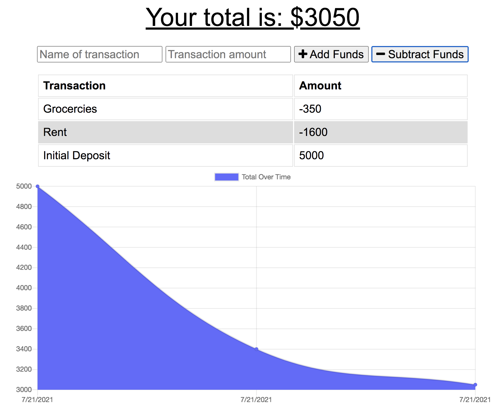
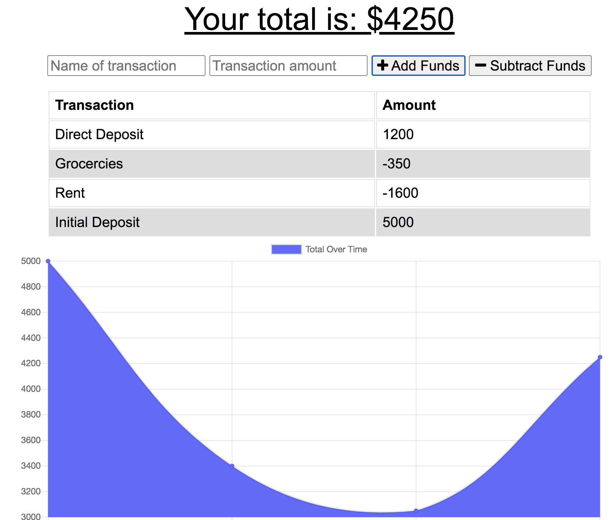

# Budget Tracker 

## Deployed application

Application: [Budget Tracker](https://fast-beyond-budget.herokuapp.com/)

## Description
Budget Tracker is a progressive web application that allows users to add and subtract funds from their budget. 

The user will be able to add expenses and deposits to their budget with or without a connection. When entering transactions offline, they will populate the total when brought back online.

Offline Functionality:

  * Enter deposits offline

  * Enter expenses offline

When brought back online:

  * Offline entries will be added to tracker.

## User Story
AS AN avid traveller
I WANT to be able to track my withdrawals and deposits with or without a data/internet connection
SO THAT my account balance is accurate when I am traveling


        
## Technologies Used

```
Node.js
NPM
Express.js
IndexedDB
MongoDB
Javascript
HTML
CSS
```
## Screenshots





## Questions       
If you have any questions please contact me by email or through my GitHub profile
        
* Email: ashquinngordon@gmail.com
        
## License      
Licensed under the Mozilla Public License 2.0 license. Use the following link for permissions and allowances:
https://opensource.org/licenses/MPL-2.0